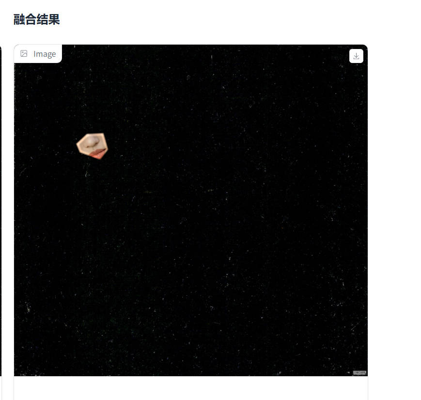

# Implementation of DIP with PyTorch

This repository is Mengyu Xie's implementation of Assignment_02.

## Running And Training

To run poisson blending, run:

```python
python blending_gradio.py
```

To train the pixtopix model ,run:

```
python simple_train.py
```

## Evaluation

To evaluate the pixtopix model , run:

```python
python evalute_model.py
```

The code loads the model that achieves the best performance on the validation set during training, and performs image restoration tests on the test set, which are divided into two parts: evaluation metrics and actual image examples.

## Results

The example video and final results of Poisson image fusion are as follows.

<video src="blending.mp4" controls width="100%"></video>

The blending image is:



And the result of the pixtopix model will show.

The metrics result is:

| Metric |   Mean    |   Std    |
| :----: | :-------: | :------: |
|   L1   | 0.346572  | 0.034404 |
|  MSE   | 0.211006  | 0.039928 |
|  PSNR  | 12.853904 | 0.812962 |
|  SSIM  | 0.399349  | 0.077779 |

Some image generation examples from the test set:


