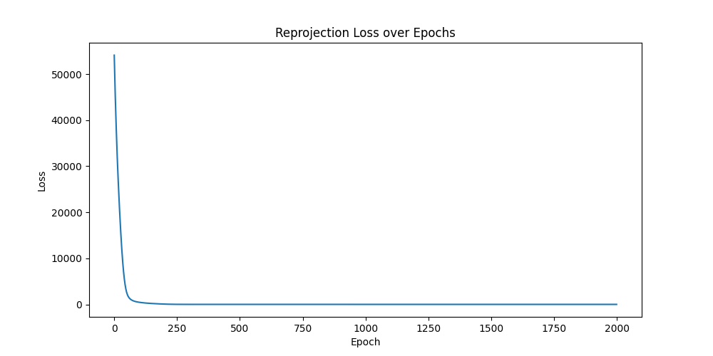

# Bundle Adjustment

This repository is Mengyu Xie's implementation of Assignment_03.

## Running And Training

To Implement Bundle Adjustment with PyTorch, run:

```python
python bundle_adjustment.py
```


## Result

使用pytorch插件3d点云的训练曲线：



The result  is:

<video src="reconstruction.mp4" controls width="100%"></video>

Using colmap windows to 对五十张图片进行稀疏重建：

<video src="sparse.mp4" controls width="100%"></video>
